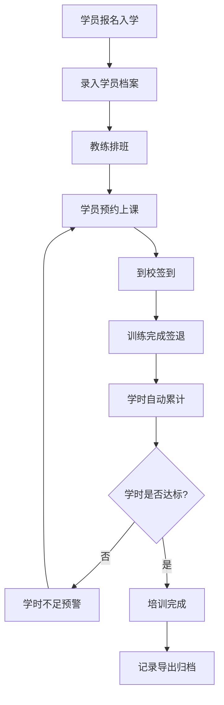

## 1. 产品概述

驾校学员学时后台管理系统，为驾校提供学员档案管理、课程排班、签到打卡、学时统计、学时不足预警及记录导出的一站式解决方案。目标用户为驾校管理员和教练，旨在替代手工台账，提升学时管理效率和合规性。

## 2. 核心功能

### 2.1 用户角色

| 角色 | 注册方式 | 核心权限 |
|------|----------|----------|
| 管理员 | 系统预设账号 | 全部功能：学员管理、排班、统计、导出、系统配置 |
| 教练 | 管理员创建 | 查看所带学员、签到打卡、查看学时统计 |

### 2.2 功能模块

1. **仪表盘**: 数据概览、今日待办、学时不足预警、快捷操作入口
2. **学员档案**: 学员信息CRUD、培训阶段跟踪、证件信息管理
3. **课程排班**: 教练排班表、学员预约上课、课程类型管理（科目一至科目四）
4. **签到打卡**: 教练端签到操作、签到/签退记录、GPS定位辅助
5. **学时统计**: 个体学时汇总、批量学时报表、培训进度可视化
6. **学时不足提醒**: 自动预警规则、预警列表、通知提醒
7. **记录导出**: Excel/CSV导出、自定义筛选条件、导出历史

### 2.3 页面详情

| 页面名称 | 模块名称 | 功能描述 |
|----------|----------|----------|
| 仪表盘 | 数据概览卡片 | 在训学员总数、今日上课人数、本月完成学时、学时不足预警数 |
| 仪表盘 | 学时不足预警列表 | 显示学时不足的学员，可快速跳转至学员详情 |
| 仪表盘 | 快捷操作 | 新增学员、今日签到、导出报表等快捷入口 |
| 学员档案 | 学员列表 | 搜索、筛选、分页展示学员，支持批量操作 |
| 学员档案 | 新增/编辑学员 | 表单录入学员基本信息、培训类型、报名日期等 |
| 学员档案 | 学员详情 | 学员信息、培训进度、学时明细、签到记录时间线 |
| 课程排班 | 排班日历 | 日/周/月视图展示教练排班，支持拖拽调整 |
| 课程排班 | 新增排班 | 选择教练、时间段、课程类型、可容纳人数 |
| 课程排班 | 学员预约 | 学员选择可用时段预约上课 |
| 签到打卡 | 签到操作面板 | 选择学员→签到/签退，记录时间 |
| 签到打卡 | 签到记录 | 按日期/教练/学员筛选查看历史签到记录 |
| 学时统计 | 个人学时报表 | 单个学员各科目学时明细与汇总 |
| 学时统计 | 批量学时报表 | 按班级/教练/时间段批量统计 |
| 学时统计 | 培训进度图 | 可视化展示各科目学时完成率 |
| 学时不足提醒 | 预警规则配置 | 设定各科目最低学时阈值 |
| 学时不足提醒 | 预警列表 | 展示当前学时不足学员，支持标记已处理 |
| 记录导出 | 导出配置 | 选择导出类型、时间范围、筛选条件 |
| 记录导出 | 导出历史 | 查看已导出文件列表，支持重新下载 |

## 3. 核心流程

学员入学→录入档案→教练排班→学员预约→到校签到→训练签退→学时累计→学时不足预警→培训完成→记录导出

## 4. 用户界面设计

### 4.1 设计风格

- 主色调：深蓝色(#1E3A5F) 搭配活力橙(#F59E0B) 作为强调色
- 次要色：浅灰(#F8FAFC) 背景、白色卡片
- 按钮风格：圆角(8px)，主按钮实色填充，次按钮描边
- 字体：思源黑体/Noto Sans SC，标题18-24px，正文14px，辅助文字12px
- 布局：左侧固定导航栏 + 右侧内容区域，卡片式内容组织
- 图标风格：线性图标(Lucide)，统一2px描边

### 4.2 页面设计概览

| 页面名称 | 模块名称 | UI元素 |
|----------|----------|--------|
| 仪表盘 | 数据概览卡片 | 4列网格，渐变背景卡片，数字+图标+趋势箭头，hover微缩放 |
| 仪表盘 | 预警列表 | 白色卡片，红色/橙色标记条，列表项hover高亮 |
| 学员档案 | 学员列表 | 搜索栏+筛选器+表格，表头固定，斑马纹行，操作按钮列 |
| 学员档案 | 新增/编辑表单 | 居中弹窗(Modal)，分组表单，必填项红星标记 |
| 课程排班 | 排班日历 | 周视图为主，时间段色块标识不同课程类型，拖拽交互 |
| 签到打卡 | 签到面板 | 大按钮签到/签退，当前时间显示，学员头像列表 |
| 学时统计 | 统计图表 | 柱状图+进度条组合，科目标签页切换 |
| 学时不足提醒 | 预警列表 | 紧急程度排序，红/黄/绿状态标签，快捷操作按钮 |
| 记录导出 | 导出配置 | 分步表单，条件筛选器组，导出按钮+进度条 |

### 4.3 响应式设计

- 桌面优先设计，支持1440px+大屏和1280px标准屏幕
- 导航栏在小屏幕下折叠为图标模式
- 表格在小屏幕下支持横向滚动
- 移动端适配基本浏览操作

## 5. 非功能性需求

- 数据持久化：SQLite本地存储，无需额外数据库服务
- 性能：页面首屏加载<2秒，表格渲染1000行无卡顿
- 安全：管理员登录鉴权，API接口Token校验
- 导出：支持Excel(.xlsx)和CSV两种格式
