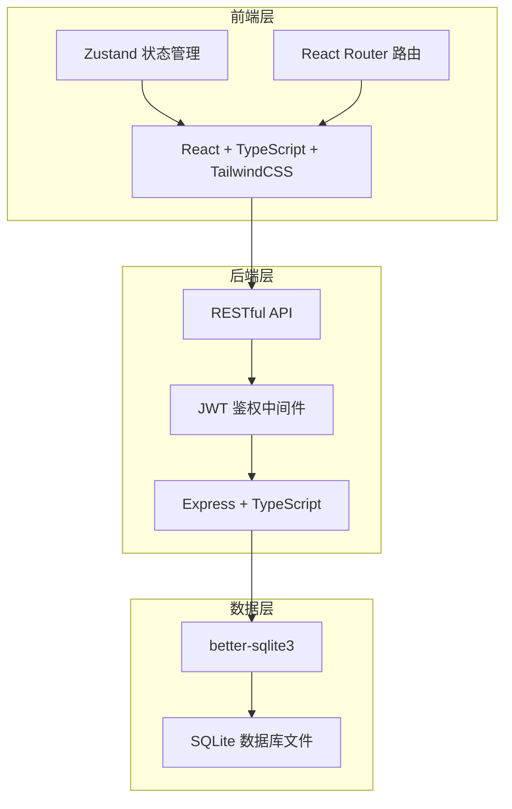
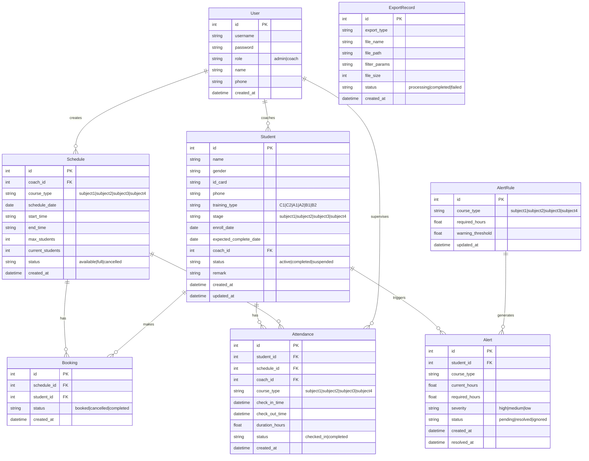

## 1. 架构设计



## 2. 技术说明

- 前端：React@18 + TailwindCSS@3 + Vite + Zustand
- 初始化工具：vite-init
- 后端：Express@4 + TypeScript (ESM)
- 数据库：better-sqlite3（本地SQLite，零配置部署）
- 图表库：recharts（学时统计可视化）
- 导出库：xlsx（Excel导出）
- 图标库：lucide-react
- 日期处理：date-fns

## 3. 路由定义

| 路由 | 用途 |
|------|------|
| / | 仪表盘 - 数据概览 |
| /students | 学员档案列表 |
| /students/:id | 学员详情页 |
| /scheduling | 课程排班日历 |
| /attendance | 签到打卡 |
| /statistics | 学时统计 |
| /alerts | 学时不足提醒 |
| /export | 记录导出 |

## 4. API定义

### 4.1 认证

```typescript
POST   /api/auth/login          // 管理员登录
POST   /api/auth/logout         // 退出登录
GET    /api/auth/me             // 获取当前用户信息
```

### 4.2 学员档案

```typescript
GET    /api/students             // 学员列表（分页、搜索、筛选）
GET    /api/students/:id         // 学员详情
POST   /api/students             // 新增学员
PUT    /api/students/:id         // 更新学员信息
DELETE /api/students/:id         // 删除学员
```

### 4.3 课程排班

```typescript
GET    /api/schedules            // 排班列表（按日期范围查询）
POST   /api/schedules            // 新增排班
PUT    /api/schedules/:id        // 更新排班
DELETE /api/schedules/:id        // 删除排班
GET    /api/schedules/available  // 查询可用时段
POST   /api/schedules/:id/book   // 学员预约
DELETE /api/schedules/:id/book/:studentId  // 取消预约
```

### 4.4 签到打卡

```typescript
POST   /api/attendance/check-in   // 签到
POST   /api/attendance/check-out  // 签退
GET    /api/attendance             // 签到记录（分页、筛选）
GET    /api/attendance/today       // 今日签到状态
```

### 4.5 学时统计

```typescript
GET    /api/statistics/overview          // 仪表盘概览数据
GET    /api/statistics/student/:id       // 单个学员学时统计
GET    /api/statistics/batch             // 批量学时统计
GET    /api/statistics/progress/:id      // 培训进度详情
```

### 4.6 学时不足提醒

```typescript
GET    /api/alerts                // 预警列表
GET    /api/alerts/rules          // 预警规则配置
PUT    /api/alerts/rules          // 更新预警规则
PUT    /api/alerts/:id/status     // 标记预警状态
```

### 4.7 记录导出

```typescript
POST   /api/export                // 请求导出（返回文件流）
GET    /api/export/history        // 导出历史
```

### 4.8 教练管理

```typescript
GET    /api/coaches               // 教练列表
POST   /api/coaches               // 新增教练
PUT    /api/coaches/:id           // 更新教练信息
DELETE /api/coaches/:id           // 删除教练
```

## 5. 数据模型

### 5.1 数据模型定义



### 5.2 数据定义语言

```sql
CREATE TABLE users (
    id INTEGER PRIMARY KEY AUTOINCREMENT,
    username TEXT NOT NULL UNIQUE,
    password TEXT NOT NULL,
    role TEXT NOT NULL CHECK(role IN ('admin', 'coach')),
    name TEXT NOT NULL,
    phone TEXT,
    created_at TEXT DEFAULT (datetime('now'))
);

CREATE TABLE students (
    id INTEGER PRIMARY KEY AUTOINCREMENT,
    name TEXT NOT NULL,
    gender TEXT CHECK(gender IN ('male', 'female')),
    id_card TEXT UNIQUE,
    phone TEXT,
    training_type TEXT NOT NULL CHECK(training_type IN ('C1', 'C2', 'A1', 'A2', 'B1', 'B2')),
    stage TEXT NOT NULL DEFAULT 'subject1' CHECK(stage IN ('subject1', 'subject2', 'subject3', 'subject4')),
    enroll_date TEXT NOT NULL,
    expected_complete_date TEXT,
    coach_id INTEGER REFERENCES users(id),
    status TEXT NOT NULL DEFAULT 'active' CHECK(status IN ('active', 'completed', 'suspended')),
    remark TEXT,
    created_at TEXT DEFAULT (datetime('now')),
    updated_at TEXT DEFAULT (datetime('now'))
);

CREATE TABLE schedules (
    id INTEGER PRIMARY KEY AUTOINCREMENT,
    coach_id INTEGER NOT NULL REFERENCES users(id),
    course_type TEXT NOT NULL CHECK(course_type IN ('subject1', 'subject2', 'subject3', 'subject4')),
    schedule_date TEXT NOT NULL,
    start_time TEXT NOT NULL,
    end_time TEXT NOT NULL,
    max_students INTEGER NOT NULL DEFAULT 4,
    current_students INTEGER NOT NULL DEFAULT 0,
    status TEXT NOT NULL DEFAULT 'available' CHECK(status IN ('available', 'full', 'cancelled')),
    created_at TEXT DEFAULT (datetime('now'))
);

CREATE TABLE bookings (
    id INTEGER PRIMARY KEY AUTOINCREMENT,
    schedule_id INTEGER NOT NULL REFERENCES schedules(id),
    student_id INTEGER NOT NULL REFERENCES students(id),
    status TEXT NOT NULL DEFAULT 'booked' CHECK(status IN ('booked', 'cancelled', 'completed')),
    created_at TEXT DEFAULT (datetime('now'))
);

CREATE TABLE attendance (
    id INTEGER PRIMARY KEY AUTOINCREMENT,
    student_id INTEGER NOT NULL REFERENCES students(id),
    schedule_id INTEGER REFERENCES schedules(id),
    coach_id INTEGER NOT NULL REFERENCES users(id),
    course_type TEXT NOT NULL CHECK(course_type IN ('subject1', 'subject2', 'subject3', 'subject4')),
    check_in_time TEXT NOT NULL,
    check_out_time TEXT,
    duration_hours REAL DEFAULT 0,
    status TEXT NOT NULL DEFAULT 'checked_in' CHECK(status IN ('checked_in', 'completed')),
    created_at TEXT DEFAULT (datetime('now'))
);

CREATE TABLE alert_rules (
    id INTEGER PRIMARY KEY AUTOINCREMENT,
    course_type TEXT NOT NULL UNIQUE CHECK(course_type IN ('subject1', 'subject2', 'subject3', 'subject4')),
    required_hours REAL NOT NULL,
    warning_threshold REAL NOT NULL DEFAULT 0.8,
    updated_at TEXT DEFAULT (datetime('now'))
);

CREATE TABLE alerts (
    id INTEGER PRIMARY KEY AUTOINCREMENT,
    student_id INTEGER NOT NULL REFERENCES students(id),
    course_type TEXT NOT NULL,
    current_hours REAL NOT NULL DEFAULT 0,
    required_hours REAL NOT NULL,
    severity TEXT NOT NULL CHECK(severity IN ('high', 'medium', 'low')),
    status TEXT NOT NULL DEFAULT 'pending' CHECK(status IN ('pending', 'resolved', 'ignored')),
    created_at TEXT DEFAULT (datetime('now')),
    resolved_at TEXT
);

CREATE TABLE export_records (
    id INTEGER PRIMARY KEY AUTOINCREMENT,
    export_type TEXT NOT NULL,
    file_name TEXT NOT NULL,
    file_path TEXT NOT NULL,
    filter_params TEXT,
    file_size INTEGER,
    status TEXT NOT NULL DEFAULT 'processing' CHECK(status IN ('processing', 'completed', 'failed')),
    created_at TEXT DEFAULT (datetime('now'))
);

-- 初始数据
INSERT INTO users (username, password, role, name, phone) VALUES ('admin', 'admin123', 'admin', '系统管理员', '13800000000');
INSERT INTO users (username, password, role, name, phone) VALUES ('coach1', 'coach123', 'coach', '王教练', '13800000001');
INSERT INTO users (username, password, role, name, phone) VALUES ('coach2', 'coach123', 'coach', '李教练', '13800000002');
INSERT INTO users (username, password, role, name, phone) VALUES ('coach3', 'coach123', 'coach', '张教练', '13800000003');

INSERT INTO alert_rules (course_type, required_hours, warning_threshold) VALUES ('subject1', 12, 0.8);
INSERT INTO alert_rules (course_type, required_hours, warning_threshold) VALUES ('subject2', 16, 0.8);
INSERT INTO alert_rules (course_type, required_hours, warning_threshold) VALUES ('subject3', 24, 0.8);
INSERT INTO alert_rules (course_type, required_hours, warning_threshold) VALUES ('subject4', 10, 0.8);
```
